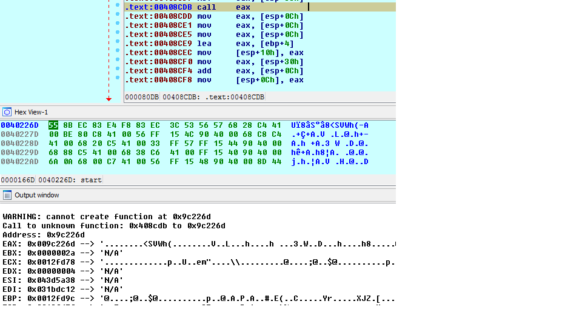

funcap
======

__IDA Pro script to add some useful runtime info to static analysis.__

_Overview_

This script records function calls (and returns) across an executable using IDA debugger API, along with all the arguments passed. It dumps the info to a text file, and also inserts it into IDA's inline comments. This way, static analysis that  usually follows the behavioral runtime analysis when analyzing malware, can be directly fed with runtime info such as decrypted strings returned in function's arguments. In author's opinion this allows to understand the program's logic way faster than starting the "zero-knowledge" reversing. Quick understanding of a malware sample code was precisely the motivation to write this script and the author has been using it succesfully at his $DAYJOB. It is best to see the examples with screenshots to see how it works (see below). It must be noted that the script has been designed with many misconceptions, errors and bad design decisions (see Issues and funcap.py code) as I was learning when coding but it has one advantage - it kind of works :) Current architectures supported are x86, amd64 and arm.

So let's look at the first example - this is how funcap inserts comments into IDA listing:

In the above example funcap has analyzed the called function using IDA automatic analysis so it knows it only takes one argument - arg_00 (note: on arm architecture stack-passed arguments are not captured yet as IDA does not have the underlying info). It captures and dereferences these arguments and tries to extrapolate to ASCII. It remembers their value until the function returns and it derefernces them again - so that we see how arguments passed by references change after the call has terminated. This is captured in "s_arg_00". Return value for the function is also captured (EAX). The example shows how function decrypting strings is being automatically revealed. Not only the strings are reavealed themselves, but also the understanding of the function becomes clear without any static analysis whatsoever, so it can be directly renamed to something like "decrypt_c2". Here is another example, this time from a real malware (Taidor APT family) where the C2 server name was captured:

Yet another example from Taidoor - a simple decoding function that will decode the name of the process to which the code will be injected. Note that the pointer to the decrypted string is being returned via EAX in this case. This example is quite usefull as Taidoor encryps body of some functions using RC4 so it further complicates and slows down static analysis:

  
funcap will also capture library calls if told so (does it by default). A library function will also be analysed on the fly to determine its number of arguments. Take a look at this example:

We see how the malware is being installed from a temporary location to persistent one by watching arguments to MoveFileEx() API call. Another interesting example (fragment of Black Energy v2 malware) shows how funcap helps to understand that what we see is a custom API resolver:

We see that the second indirect call 'call eax' is calling VirtualAlloc(). This is also an information added by funcap. But we see as well that the first function (sub_40BAD9) takes two arguments where the first argument seems to be a beginning of a PE file (starts with MZ - it is an address of memory-mapped kernel32.dll) and the second one looks like a random value which might be an API name hash (hell knows why it was succesfully referenced here - isn't an address starting with '0xa' a part of kernel memory ??). But this shows how funcap speeds up static analysis. Another small useful feature is that funcap will insert real function address which is especially important in case of indirect calls:

Funcap contains mechanisms of discovering new functions that were not present in IDA's database (code_discovery mode - not enabled by default). This is interesting in case of packed/obfuscated code. The below example shows how a call to previously unkown function was registered by funcap:

funcap should be able to analyze this new segment/function and store in IDA's database automatically but this isn't always working as some of the int 3 breakpoint hooks mess up with the dynamically created code. I'm really convinced that when I add PIN tracer support this will be much better (although PIN is limited to x86/amd64 user mode only).

All calls are also logged by default to the console and to a file (by default %USERPROFILE%\funcap.txt or ~/funcap.txt) as you can see on the following example:

File and console dumps contain more info than comments pasted into IDA and will also contain multiple passes of the same call instruction (if delete_breakpoints option is set to False). For obvious reason, IDA's comments contain only the first pass of a given call instruction. Note: the long-term development plan would be to make a right-click feature on the call to select amongst multiple recorded call instances but this requires a lot of work - and a kind of database.

Last but not least, funcap can draw a graph of function calls. The graph is similar to IDA's trace graph but has two important advantages: no trace needs to be used (means speeed) and more importantly - it is fully dynamic. IDA trace graph will not connect anything like 'call eax' beacause it only iterates over xrefs that are present in the IDB. funcap graph has this working properly.

funcap also takes a dump of all string arguments to a file (by defualt %USERPROFILE%\funcap_strings.txt). This is more/less equivalent to performing a 'strings' command on function arguments which can also be quite handy. This is slightly more effective than a dump of process memory because even strings that are decrypted and then re-encrypted after use (and I have seen this already), will be captured.

_How to use_

The usage is very easy. At any moment in time, either before a debugging session or in the middle of it when things get interesting, you can run the script and it will be automatically enabled. All the commands are operated from the Python console via the main class 'd'. To turn the script off and on:

    Python>d.off()
    FunCap is OFF
    Python>d.on()
    FunCap is ON

You can now add breakpoints on any part in the code and during the execution it will be interpreted depending on the instruction or code context. Call instructions will be logged as function calls and return from the call will also be automatically recorded. If the instruction is spotted at the beginning or at the end of a function, full registry and arguments will be captured and pasted into the listing (start and end of function is the only place where we can fit a lot of info as it will not make reading the code difficult in this case). Jump instruction will get their destination resolved as well as call instructions. On any other instruction a generic context capture is performed.

To facilitate adding breakpoints, you can use this helper function:

    Python>d.addCaller()
    hooking segment: .text

It will place breakpoints on all the call instructions in the current segment. It can also do the same for a particular function (using func='function_name' parameter). If you want to only hook one function and all the others that are called by it, set 'd.recursive' to True. There is many other options available (such as d.hexdump, d.code_discovery etc.) that are described in pydocs and comments in the script body. If you prefer to hook instructions at function start/end instead of call instructions, use d.addCallee().

There is also an automation class called 'a' that can be used to run a Windows user mode program, hook functions and stop just before the program exits (to have all the debug segments left for examination before they disappear). It implements three automation routines: a.win_call_capture(), a.win_func_capture() and a.win_code_discovery() (the last one is useful when the code is packed/obfuscated and creates dynamic code). For more info look into funcap.py.

_Known limitations_
- problems with dbg_step_into() in IDA pro - observing random misbehavior sometimes, e.g. single step does not trigger where it should or vice versa
- "Analyzing area" needs to be cancelled by clicking on it when analyzing some API calls (seems it's IDA bug as well) if not it lasts very long
- on ARM - there is no stack-based arguments passing capture - IDA does not seem to give needed info regarding the stack frame. 4 register based args are captured, though, which makes it for most of the functions
