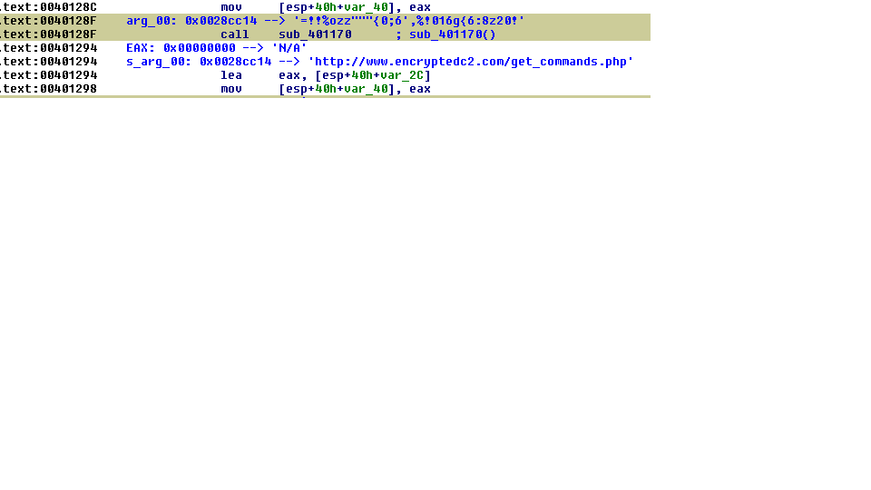
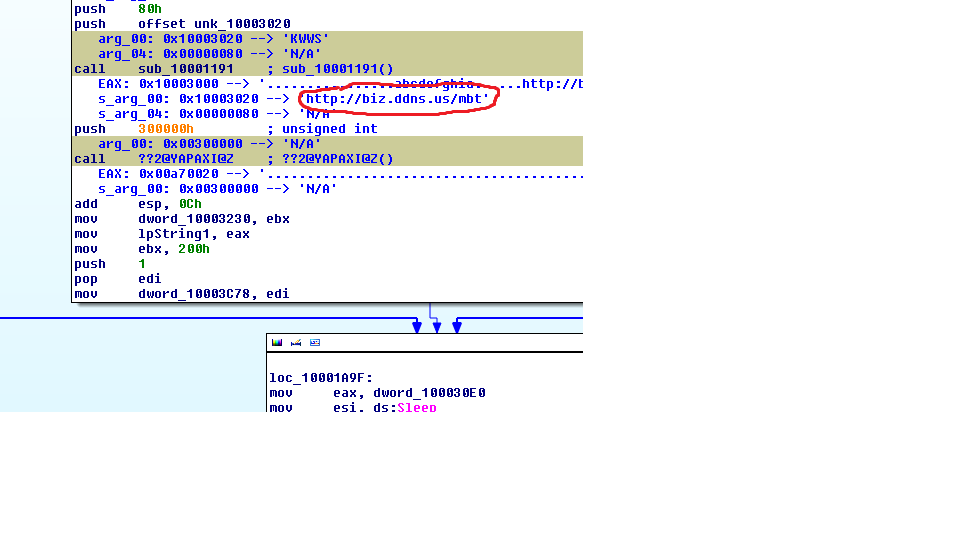
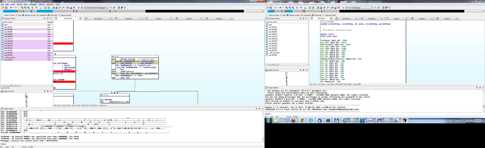
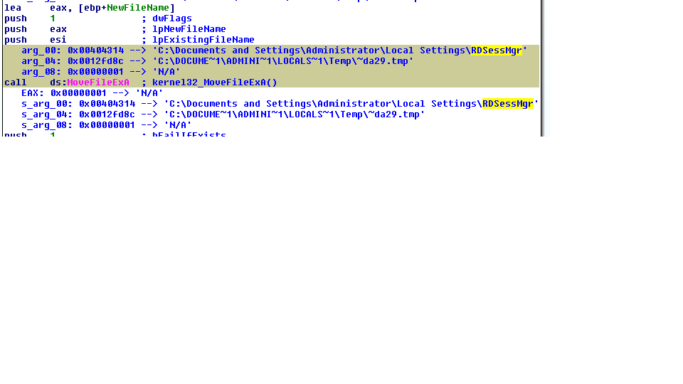
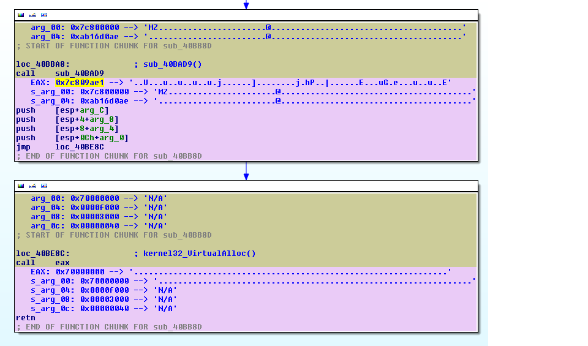
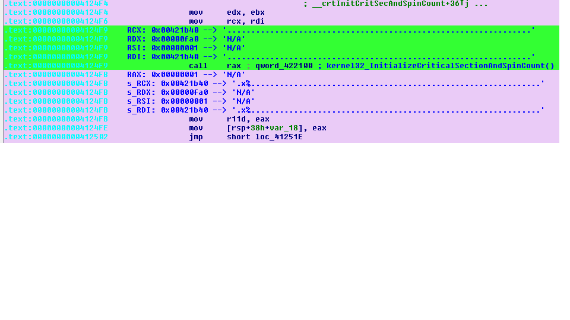
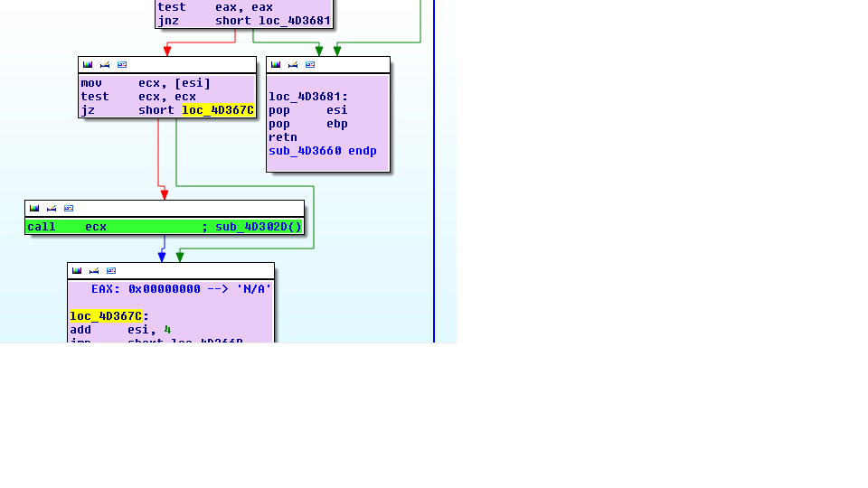
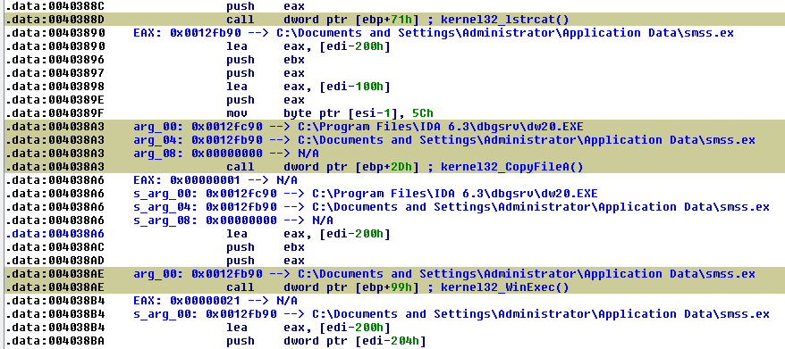
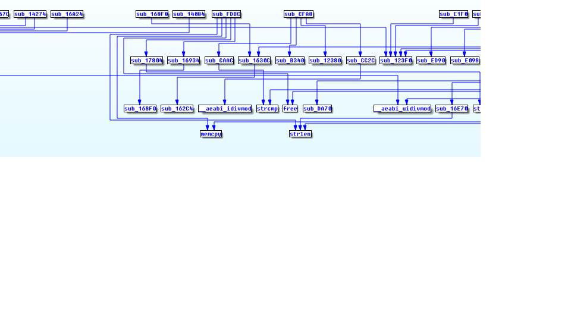
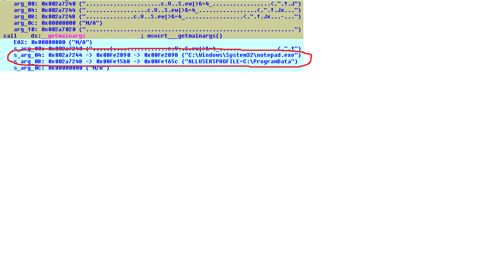

funcap
======

__IDA Pro script to add some useful runtime info to static analysis.__

_Overview_

This script records function calls (and returns) across an executable using IDA debugger API, along with all the arguments passed. It dumps the info to a text file, and also inserts it into IDA's inline comments. This way, static analysis that  usually follows the behavioral runtime analysis when analyzing malware, can be directly fed with runtime info such as decrypted strings returned in function's arguments. In author's opinion this allows to understand the program's logic way faster than starting the "zero-knowledge" reversing. Quick understanding of a malware sample code was precisely the motivation to write this script and the author has been using it succesfully at his $DAYJOB. It is best to see the examples with screenshots to see how it works (see below). It must be noted that the script has been designed with many misconceptions, errors and bad design decisions (see [issues](https://github.com/deresz/funcap/issues) and [funcap.py](https://github.com/deresz/funcap/blob/master/funcap.py) code) as I was learning when coding but it has one advantage - it kind of works :) Current architectures supported are x86, amd64 and arm.

So let's look at the first example - this is how funcap inserts comments into IDA listing:

In the above example funcap has analyzed the called function using IDA automatic analysis so it knows it only takes one argument - arg_00 (note: on arm architecture stack-passed arguments are not captured yet as IDA does not have the underlying info). It captures and dereferences these arguments and tries to extrapolate to ASCII. It remembers their value until the function returns and it derefernces them again - so that we see how arguments passed by references change after the call has terminated. This is captured in "s_arg_00". Return value for the function is also captured (EAX). The example shows how function decrypting strings is being automatically revealed. Not only the strings are reavealed themselves, but also the understanding of the function becomes clear without any static analysis whatsoever, so it can be directly renamed to something like "decrypt_c2". Here is another example, this time from a real malware (Taidor APT family) where the C2 server name was captured:

Yet another example from Taidoor - a simple decoding function that will decode the name of the process to which the code will be injected. Note that the pointer to the decrypted string is being returned via EAX in this case. This example is quite usefull as Taidoor encryps body of some functions using RC4 so it further complicates and slows down static analysis:

funcap will also capture library calls if told so (does it by default). A library function will also be analysed on the fly to determine its number of arguments. Take a look at this example:

We see how the malware is being installed from a temporary location to persistent one by watching arguments to MoveFileEx() API call. Another interesting example (fragment of Black Energy v2 malware) shows how funcap helps to understand that what we see is a custom API resolver:

We see that the second indirect call 'call eax' is calling VirtualAlloc(). This is also an information added by funcap. But we see as well that the first function (sub_40BAD9) takes two arguments where the first argument seems to be a beginning of a PE file (starts with MZ - it is an address of memory-mapped kernel32.dll) and the second one looks like a random value which might be an API name hash (hell knows why it was succesfully referenced here - isn't an address starting with '0xa' a part of kernel memory ??). But this shows how funcap speeds up static analysis. Another small useful feature is that funcap will insert real function address which is especially important in case of indirect calls:

Funcap contains mechanisms of discovering new functions that were not present in IDA's database This mode is not enabled by default, you can set with the following:

    Python>d.code_discovery = True

This is interesting in case of packed/obfuscated code. The below example shows how function calls in decrypted unkown code segment were registered by funcap:

funcap should be able to analyze this new deobfuscated segment/function. Moreover, it should be able to capture function calls in such a segment. As you can see on the above screenshot the API calls in the newly discovered code segment are being called with the use of EBP as a base register. funcap reveals which API function is called as well as provides the argument it was called with. The analyst can instantly realize that the malware in the above example is just installing itself in the system to make itself persistent across reboot. NOTE: to be able to do static analysis of such a segment after your debugging session has been ended, you need to take a memory snapshot in IDA (Debug menu). You need to do it _before_ the process ends (or before the new segment is overwriten as some very clever malwares do this). You can add a stop point at kernel32_ExitProcess, or you can use a.win_code_discovery() automation function (see later in this README). There are cases where funcap can mess up with the dynamic segments because of the use of classic int 3 inline breakpoints but this could usually be tracked down and the interfering breakpoints can be removed. Also be aware of the anti-debug tricks such as calculating the checksum over the decryptor stub. To make it work beter it would be cool to implement funcap as a PIN tool but this obviously requires some C development effort (and there are more challenges to that - btw, take a minute to have look at an interesting project which also approaches this problem, http://code.google.com/p/malwasm/).

All calls are also logged by default to the console and to a file (by default %USERPROFILE%\funcap.txt or ~/funcap.txt) as you can see on the following example:

File and console dumps contain more info than comments pasted into IDA and will also contain multiple passes of the same call instruction (if delete_breakpoints option is set to False). For obvious reason, IDA's comments contain only the first pass of a given call instruction. Note: the long-term development plan would be to make a right-click feature on the call to select amongst multiple recorded call instances but this requires a lot of work - and a kind of database.

Last but not least, funcap can draw a graph of function calls. The graph is similar to IDA's trace graph but has two important advantages: no trace needs to be used (means speed) and more importantly - it is fully dynamic. IDA trace graph will not connect anything like 'call eax' beacause it only iterates over xrefs that are present in the IDB. funcap graph has this working properly.

funcap also takes a dump of all string arguments to a file (by defualt %USERPROFILE%\funcap_strings.txt). This is more/less equivalent to performing a 'strings' command on function arguments which can also be quite handy. This is slightly more effective than 'strings'command run on a dump of process memory because even strings that are decrypted and then re-encrypted after use (and I have seen this already), will be captured.

_How to use_

The usage is very easy. At any moment in time, either before a debugging session or in the middle of it when things get interesting, you can run the script and it will be automatically enabled. All the commands are operated from the Python console via the object 'd'. To turn the script off and on:

    Python>d.off()
    FunCap is OFF
    Python>d.on()
    FunCap is ON

You can now add breakpoints on any part in the code and during the execution it will be interpreted depending on the instruction or code context. Call instructions will be logged as function calls and return from the call will also be automatically recorded. If the instruction is spotted at the beginning or at the end of a function, all registers and stack-based arguments will be captured and pasted into the listing (start and end of function is the only place where we can fit a lot of info as it will not make reading the code difficult in this case). Jump instruction will get their destination resolved as well as call instructions. On any other instruction a generic context capture is performed (just register dump).

To facilitate adding breakpoints, you can use this helper function:

    Python>d.hookSeg()
    hooking segment: .text

It will place breakpoints on all the call instructions in the current segment. If you use the seg='segment_name' it will do the same for a specified segment. If you want to add breakpoints on call instruction in the currently displayed function use this:

    Python>d.hookFunc()
    hooking function: WinMain()

You can also do the same for a particular function using func='function_name' parameter, like this:

    Python>d.hookFunc(func="myfunc")
    hooking function: myfunc()

If you want that all the called function be dynamically hooked as well, type 'd.recursive = True'. There are many other options available (such as d.hexdump, d.code_discovery etc.) that are described in pydocs and comments in the script body. If you prefer to hook instructions at function start/end instead of call instructions and have more info from registers in IDA listings but only first spotted call for a particular function captured, use d.addCallee().

To draw a graph type:

    Python>d.graph()

Unfortunately graph is not saved in the IDB file. To save the graph you can type:

    Python>d.saveGraph()

The graph file will be saved %USERPROFILE%\funcap.graph. You can also specify a path:

	Python>d.saveGraph("path")

To load a graph after loading your IDB file later on type:

    Python>d.loadGraph()

Or if you want to load it from the path other than %USERPROFILE%\funcap.graph type:

	Python>d.loadGraph("path")

There is more methods to interface with the "public interface" of object d, of which the most useful are:

    delAll(self):
        Delete all breakpoints

    addStop(self, ea):
        Add a stop point - the script will pause the process when this is reached

        @param ea: address of the new stop point to add

    addCJ(self, func = ""):
        Hook noth call and jump instructions

        @param func: name of the function to hook

The below is a list of parameters that can be changed from the console after loading the script or during the class instantiantion:

    @param outfile: log file where the output dump will be written (default: %USERPROFILE%\funcap.txt)
    @param delete_breakpoints: delete a breakpoint after first pass ? (default: yes)
    @param hexdump: include hexdump instead of ascii in outfile and IDA comments ? (default: no)
    @param comments: add IDA comments ? (default: yes)
    @param resume: resume program after hitting a breakpoint ? (default: yes)
    @param depth: current stack depth capture for non-function hits (default: 0)
    @param colors: mark the passage with colors ? (default: yes)
    @param output_console: print everything to the console ? (default: yes)
    @param overwrite_existing: overwrite existing capture comment in IDA when the same function is called ? (default: no)
    @param recursive: when breaking on a call - are we recursively hooking all call instructions in the new function ? (default: no)
    @param code_discovery: enable discovery of a dynamically created code - for obfuscators and stuff like that (default: no)
    @param no_dll: disable API calls capturing (default: no)
    @param strings_file: file containing strings dump on captured function arguments (default: %USERPROFILE%\funcap_strings.txt)

You can change any parameter using a substitution from the console, for example:

    Python>d.hex_dump = True

For more info look into funcap.py. There is also an automation object called 'a' that can be used to run a Windows user mode program, hook functions and stop just before the program exits (to have all the debug segments left for examination before they disappear). It implements three automation routines: a.win_call_capture(), a.win_func_capture() and a.win_code_discovery() (the last one is useful when the code is packed/obfuscated and creates dynamic code). This class shows how you can use funcap and how you can write additional automation scripts. For example:

	Python>a.win_call_capture()

This will read the entry point, hook the segment where the entry point has been found, run the application with function call capture and stop it just before it exits.

There is also some configuration items that can be changed by modifying the script body. Example: say your program is using a register to pass arguments in addition to the stack, like for example MS x86 compiler does by using ECX in case of C++ code to pass the "this" pointer, and you want to see this register in your IDA comments after funcap has been run. In the class corresponding to your architecture you can modify these lines:

    self.CMT_CALL_CTX = [re.compile('^arg')]
    self.CMT_RET_CTX = [re.compile('^EAX')]
    self.CMT_RET_SAVED_CTX = [re.compile('^arg')]

To look like:

    self.CMT_CALL_CTX = [re.compile('^arg'), re.compile('^ECX')]
    self.CMT_RET_CTX = [re.compile('^EAX')]
    self.CMT_RET_SAVED_CTX = [re.compile('^arg'), re.compile('^ECX')]

If you happen to use funcap with WinDbg (I am using it to debug Windows kernel mode code), use "Script command" from File menu as the console is being taken over by WINDBG prompt during the debugging session.

_NOTE:_ when debugging executables linked with glibc, for example Linux ELF binaries, set the environment variable LD_BIND_NOW=1 in order for linker to do all the PLT fixups at program load, otherwise the first call to a given API will not be properly captured as funcap is unable to step into the lazy binding routines.

_Known limitations and bugs_
- "Analyzing area" needs to be cancelled by clicking on it when analyzing some API calls, if not it lasts very long
- on ARM - there is no stack-based arguments capture - IDA does not seem to give needed info regarding the stack frame. 4 register based args are captured, though, which makes it for most of the functions

Thanks to [Bartol0](https://github.com/Bartol0) we now have multiple_dereferences option that will follow captured memory pointer multiple times trying to discover what it might point to, similar to [PEDA](http://ropshell.com/peda). Example:

In "utils" fodler you will find some other useful scripts:
- fundump.py & funload.py - a pair of scripts that will dump function names from one IDB, for example your static IDB file, and then will rename the same functions (based on their signatures) in another IDB file. For example, if you are debugging a code that is moved around in memory in a non-standard way and IDA is not able to be told that it is your relocated static IDB, this is for you.

__Video tutorials__

[Part 1](https://www.youtube.com/watch?v=gZfV-sjMH0A)
[Part 2](https://www.youtube.com/watch?v=jNQ-FjJdRTc)
[Part 3](https://www.youtube.com/watch?v=LWeYKKF7Rbg)

__Contact__

[@deresz666](http://twitter/deresz666) - deresz@gmail.com
